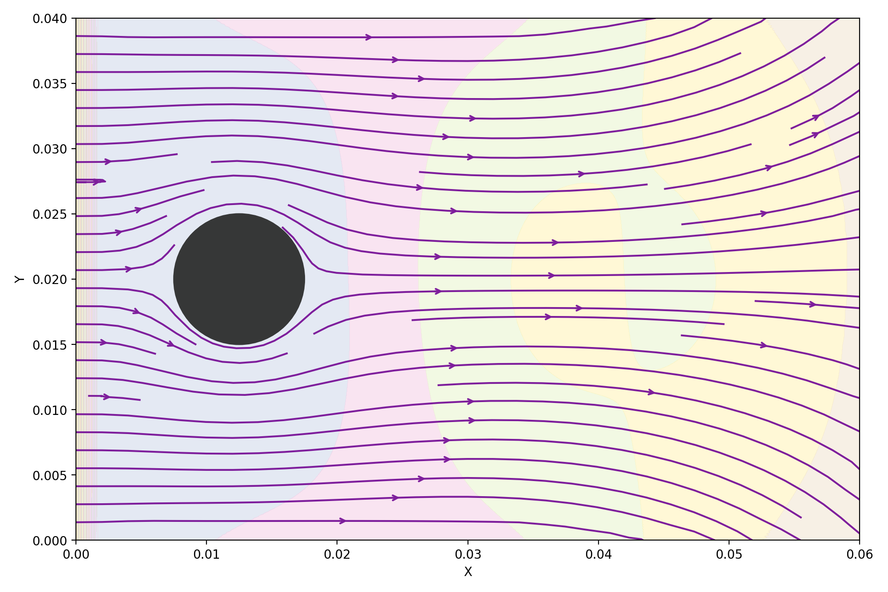
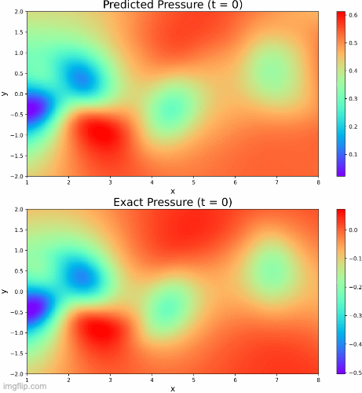

# APC524: Implementing a Navier-Stokes Solver and Physics Informed Neural
Network for Simulating Two-Dimensional Fluid Flow Around a Cylinder

* An implementation of a modular Navier-Stokes solver using the Finite Difference Method.
* A Physics Informed Neural Network that approximates a Navier-Stokes solver.
*  Unit tests and automated testing 

## Final Report and Slides
### [Final Report](project_reports/final_report/final_report.pdf)
### [Slides](project_reports/final_report/final_slides.pdf)

## Example Simulation Result


## Example Simulation Code
```python
from navier_stokes_fdm import Environment
from navier_stokes_fdm import Rectangle
import navier_stokes_fdm.boundary_condition as bc


U = 1  # m/s
dimension = 0.005

boundary_conditions = [
    bc.TopSideFixedVelocityBoundaryCondition(u_value=U, v_value=0),
    bc.BottomSideFixedVelocityBoundaryCondition(u_value=U, v_value=0),
    bc.LeftSideFixedVelocityBoundaryCondition(u_value=U, v_value=0),
    bc.RightSideFixedVelocityBoundaryCondition(u_value=U, v_value=0),
]


x1, y1 = 0.0125, (0.04 / 2) - (dimension / 2)
objects = [Rectangle(x1, y1, x1 + dimension, y1 + dimension)]


a = Environment(
    F=(1.0, 0.0),
    len_x=0.06,
    len_y=0.04,
    dt=0.00000015,
    dx=0.0001,
    boundary_conditions=boundary_conditions,
    objects=objects,
    rho=0.6125  # kg/m³
    nu=3e-5  # m²/s
)

a.run_many_steps(480)
a.plot_streamline_plot(title="", filepath="../Figures/box_example_streamline.png")

```

## Example PINN Result


## Example PINN Train and Inference Code
```python
import numpy as np
import tensorflow as tf
import matplotlib.pyplot as plt

from navier_stokes_pinn.PINN import PhysicsInformedNN
from navier_stokes_pinn.input_output import NavierStokesPINN_IO
from navier_stokes_pinn.plotting import NavierStokesPINN_Plotter


IO_manager = NavierStokesPINN_IO("navier_stokes_pinn/data", "navier_stokes_pinn/output")
IO_manager.parse_data_file('cylinder_nektar_wake.mat')

# Selecting training data
IO_manager.select_training_data(N_train=5000)

# Extract training data from IO_manager
training_data = IO_manager.training_data

# Casting the training data into tensorflow
x_train = tf.cast(training_data['x_train'], dtype=tf.float32)
y_train = tf.cast(training_data['y_train'], dtype=tf.float32)
t_train = tf.cast(training_data['t_train'], dtype=tf.float32)
u_train = tf.cast(training_data['u_train'], dtype=tf.float32)
v_train = tf.cast(training_data['v_train'], dtype=tf.float32)

# Setting model architechture
layers = [3, 20, 20, 20, 20, 20, 20, 20, 20, 2]

# Setting Reynold's Number
Re = 100

# Initializing the PINN model
# Model training support TensorFlow 2 and GPU acceleration
model = PhysicsInformedNN(x_train, y_train, t_train, u_train, v_train, Re, layers)

# Train PINN model
model.train(2000, learning_rate=1e-3)

# Select test data at a time snapshot to test run inference and test the trained model
time_snapshot = 100
IO_manager.select_test_data(time_snapshot)
test_data = IO_manager.test_data

# Run inference and save predicted data
IO_manager.save_predict_data(model, 'example_prediction_100.npz')

# Plot the predicted data and save the plot with plotting class
Plot_manager = NavierStokesPINN_Plotter("navier_stokes_pinn/data", "navier_stokes_pinn/plots", IO_manager)
# Saves the u, v. and p values at the timestep 100
Plot_manager.plot_compare_predictions('example_prediction_100.npz', time_snapshot)
```